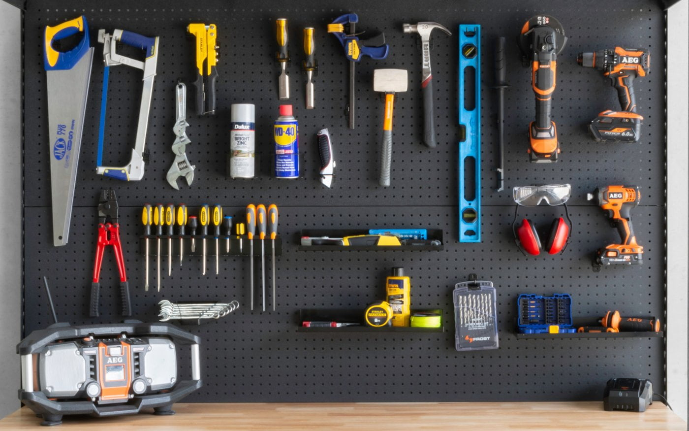

# Scene-Physics

# Overarching Research Question
Can we build probabilistic models that take physical properties and physics into account when reconstructing the 3D structure of a scene from a visual input?

## What We Are Studying
There exists compelling evidence that the human brain runs physics simulations when perceiving a scene. For example, in MIT 9.66 Computational Cognitive Science lecture, Tenenbaum showed us an image of objects on a wall.




He points out how we make an inference that there exists pins to hold up the objects because we know these objects usually doesn’t suspend in air. Our choice to add the pins used Bayesian Inference about what object could reasonably suspend the objects, and use of ground truth physics (a saw  doesn't suspend). We would like to duplicate this human-like form of visual processing through use of a physics engine and probabilistic model.  

## Why it is Interesting
This project is interesting for two reasons. First, it is a more novel approach to 3D scene reconstruction. Second, it could give us more insight into whether or not a physics engine plays a significant role in human scene reconstruction. If the model has similar performance to humans in predicting where objects go in 3D space (maybe falling for the same illusions as humans), then it creates compelling evidence that humans use physics engines in 3D reconstructions. 

# General Organization

## Dependencies

### Dependencies to Download
- Nvidia Newton: https://github.com/newton-physics/newton
- Bayes 3d: [probcomp.github.io/bayes3d/](https://github.com/probcomp/bayes3d/tree/4e2919dd82c4596b7baca570a15bb7f3a89566a4)

### Python Packages
- pyvista
- warp
- numpy

## Files
- ```Scene-Physics/objects``` contains objects used for sim
- ```Scene-Physics/physics``` contains custom physics kernels
- ```Scene-Physics/properties``` contains the shape classes and material classes
- ```Scene-Physics/recordings``` stores the recordings we've made
- ```Scene-Physics/simulation``` writes the code for simulation
- ```Scene-Physics/io``` has code for simplifying imports
- ```Scene-Physics/tasks``` has scrap code for experimenting


# Running Code
For imports to run correctly, you must specify the correct directory to run from. Currently, to run a scene, the best command to use is.

```PYTHONPATH=. python simulation/scene01.py```

