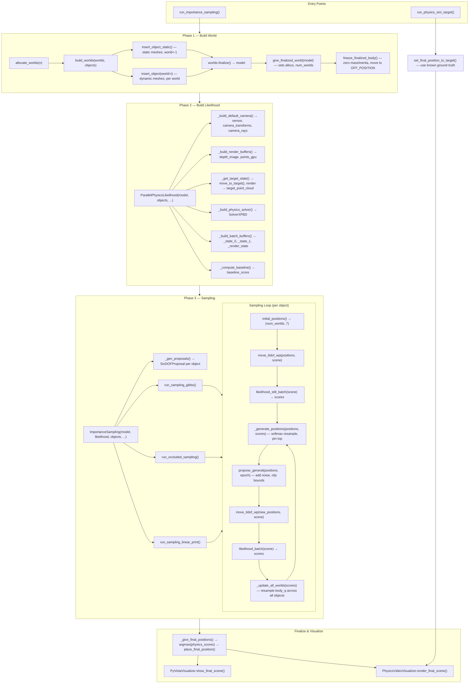
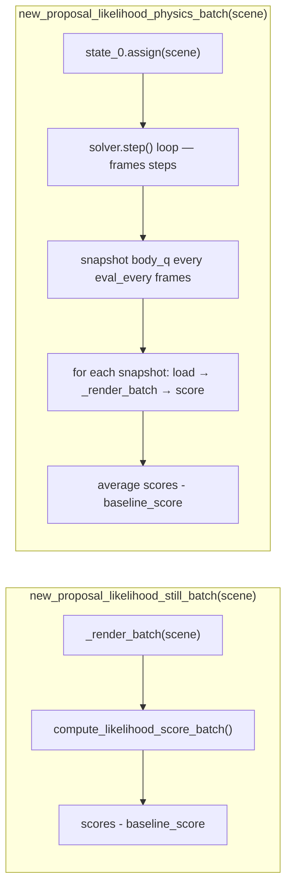
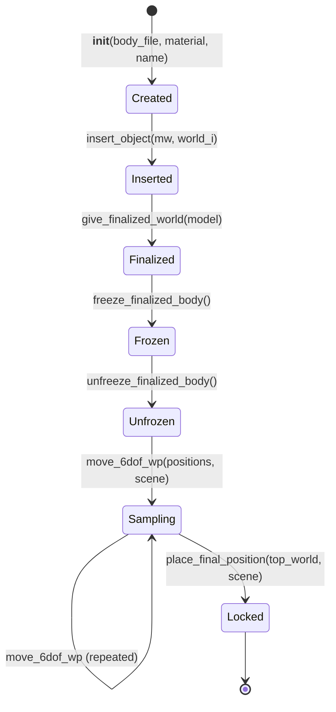
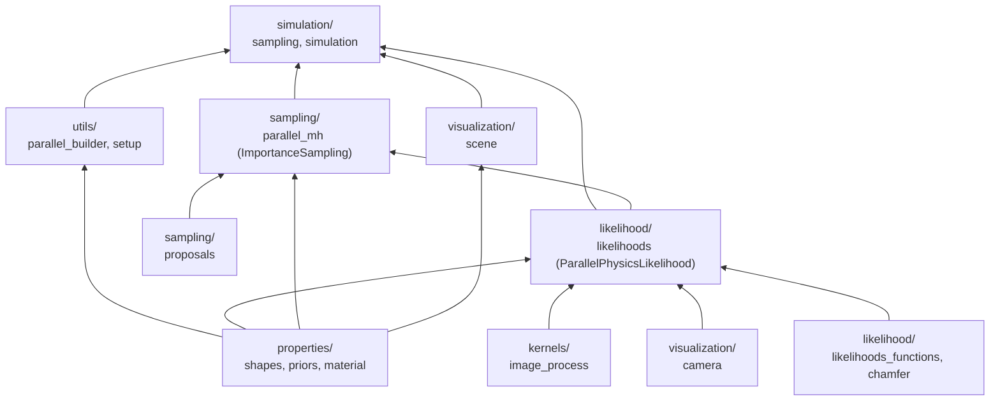

# Scene-Physics Architecture

## Pipeline Flow

```mermaid
flowchart TD
    subgraph Entry["Entry Points"]
        S["run_importance_sampling()"]
        T["run_physics_sim_target()"]
    end

    subgraph Phase1["Phase 1 — Build World"]
        AW["allocate_worlds(n)"] --> BW["build_worlds(worlds, objects)"]
        BW --> IS["insert_object_static() — static meshes, world=-1"]
        BW --> IO["insert_object(world=i) — dynamic meshes, per world"]
        IS --> FIN["worlds.finalize() → model"]
        IO --> FIN
        FIN --> GFW["give_finalized_world(model) — sets allocs, num_worlds"]
        GFW --> FRZ["freeze_finalized_body() — zero mass/inertia, move to OFF_POSITION"]
    end

    subgraph Phase2["Phase 2 — Build Likelihood"]
        PPL["ParallelPhysicsLikelihood(model, objects, ...)"]
        PPL --> CAM["_build_default_camera() → sensor, camera_transforms, camera_rays"]
        PPL --> BUF["_build_render_buffers() → depth_image, points_gpu"]
        PPL --> TGT["_get_target_state() → move_to_target(), render → target_point_cloud"]
        PPL --> SOL["_build_physics_solver() → SolverXPBD"]
        PPL --> BBF["_build_batch_buffers() → _state_0, _state_1, _render_state"]
        PPL --> BL["_compute_baseline() → baseline_score"]
    end

    subgraph Phase3["Phase 3 — Sampling"]
        IMP["ImportanceSampling(model, likelihood, objects, ...)"]
        IMP --> GP["_gen_proposals() → SixDOFProposal per object"]

        subgraph Loop["Sampling Loop (per object)"]
            direction TB
            INIT["initial_positions() → (num_worlds, 7)"]
            INIT --> MOVE["move_6dof_wp(positions, scene)"]
            MOVE --> SCORE["likelihood_still_batch(scene) → scores"]
            SCORE --> RESAMP["_generate_positions(positions, scores) — softmax resample, pin top"]
            RESAMP --> PROP["propose_general(positions, epoch) — add noise, clip bounds"]
            PROP --> MOVE2["move_6dof_wp(new_positions, scene)"]
            MOVE2 --> SCORE2["likelihood_batch(scene) → scores"]
            SCORE2 --> UPD["_update_all_worlds(scores) — resample body_q across all objects"]
            UPD --> RESAMP
        end

        IMP --> GIBBS["run_sampling_gibbs()"]
        IMP --> OCC["run_occluded_sampling()"]
        IMP --> LIN["run_sampling_linear_print()"]
        GIBBS --> Loop
        OCC --> Loop
        LIN --> Loop
    end

    subgraph Final["Finalize & Visualize"]
        GFP["_give_final_positions() → argmax(physics_scores) → place_final_position()"]
        VIS["PyVistaVisualizer.show_final_scene()"]
        VID["PhysicsVideoVisualizer.render_final_scene()"]
    end

    S --> Phase1
    Phase1 --> Phase2
    Phase2 --> Phase3
    Phase3 --> GFP
    GFP --> VIS
    GFP --> VID

    T --> SFP["set_final_position_to_target() — use known ground truth"]
    SFP --> VID
```

## Likelihood Evaluation

```mermaid
flowchart LR
    subgraph Still["new_proposal_likelihood_still_batch(scene)"]
        R1["_render_batch(scene)"] --> CS1["compute_likelihood_score_batch()"]
        CS1 --> SUB1["scores - baseline_score"]
    end

    subgraph Physics["new_proposal_likelihood_physics_batch(scene)"]
        direction TB
        ASSIGN["state_0.assign(scene)"]
        ASSIGN --> STEP["solver.step() loop — frames steps"]
        STEP --> SNAP["snapshot body_q every eval_every frames"]
        SNAP --> REPLAY["for each snapshot: load → _render_batch → score"]
        REPLAY --> AVG["average scores - baseline_score"]
    end
```

## Object Lifecycle

```mermaid
stateDiagram-v2
    [*] --> Created: __init__(body_file, material, name)
    Created --> Inserted: insert_object(mw, world_i)
    Inserted --> Finalized: give_finalized_world(model)
    Finalized --> Frozen: freeze_finalized_body()
    Frozen --> Unfrozen: unfreeze_finalized_body()
    Unfrozen --> Sampling: move_6dof_wp(positions, scene)
    Sampling --> Sampling: move_6dof_wp (repeated)
    Sampling --> Locked: place_final_position(top_world, scene)
    Locked --> [*]
```

## Module Dependency

```mermaid
flowchart BT
    props["properties/\nshapes, priors, material"]
    builder["utils/\nparallel_builder, setup"]
    kernels["kernels/\nimage_process"]
    camera["visualization/\ncamera"]
    likefn["likelihood/\nlikelihoods_functions, chamfer"]
    like["likelihood/\nlikelihoods (ParallelPhysicsLikelihood)"]
    proposals["sampling/\nproposals"]
    sampler["sampling/\nparallel_mh (ImportanceSampling)"]
    viz["visualization/\nscene"]
    sim["simulation/\nsampling, simulation"]

    props --> builder
    props --> like
    props --> sampler
    props --> viz
    kernels --> like
    camera --> like
    likefn --> like
    builder --> sim
    like --> sim
    sampler --> sim
    proposals --> sampler
    like --> sampler
    viz --> sim
```
