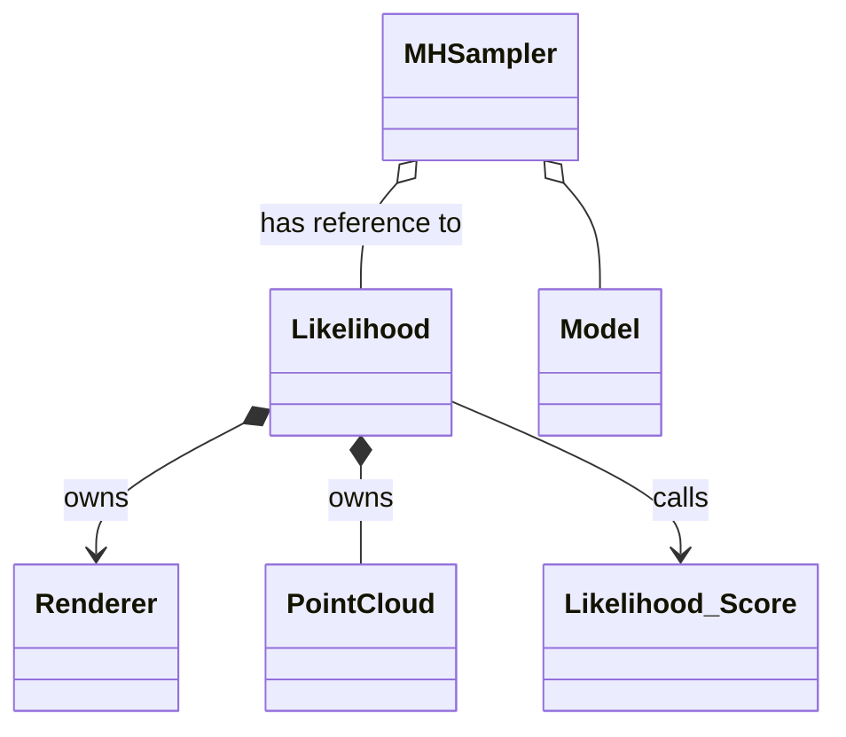

```mermaid
classDiagram
direction TB
    class Likelihood {
    }

    class Renderer {
    }

    class PointCloud {
    }

    class MHSampler {
    }

    MHSampler o-- Likelihood : has reference to
    MHSampler o-- Model: 
    Likelihood *--> Renderer : owns
    Likelihood *-- PointCloud : owns
    Likelihood --> Likelihood_Score : calls
```