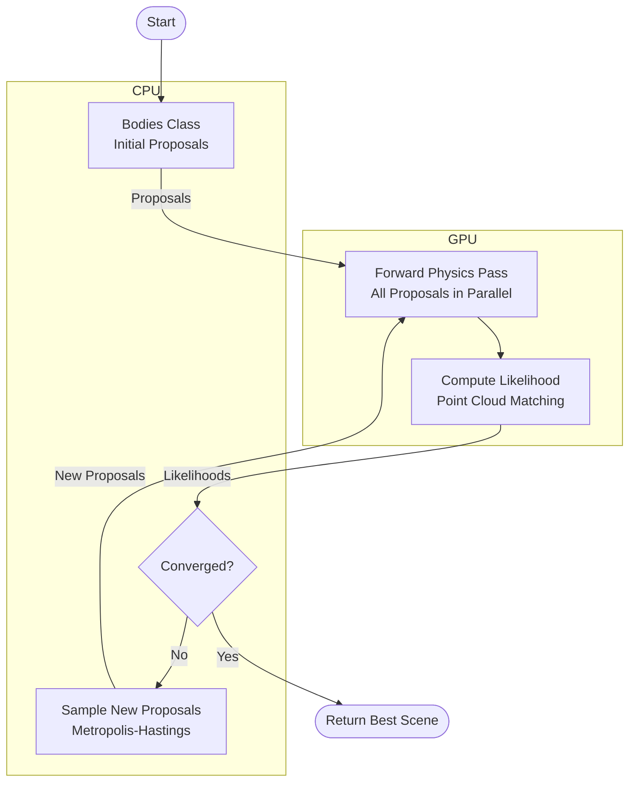

# Inference Architecture

## Overview

Proposals begin on the CPU in the `Bodies` class, are dispatched to the GPU for parallelized forward physics simulation and likelihood computation, then likelihoods are returned to the CPU for new proposal sampling. This loop continues until convergence.

## Diagram

